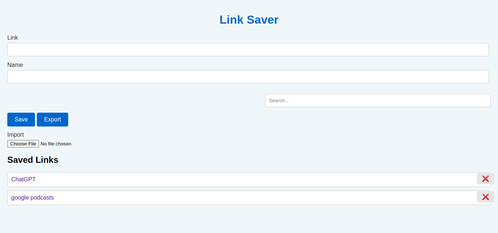

<div align="center">
  
</div>

<h1 align="center">🌐🔗
 Link Saver</h1>

<p align="center">
  <em>A simple and convenient web application to save and manage your favorite links.</em>
</p>

<a href="https://github.com/khzg/LinkSaver/archive/refs/tags/2.0.zip" download>
  <button>↓ DOWNLOAD</button>
</a>

## 📖 Description

Link Saver is a user-friendly web application that allows you to store and organize your favorite links in one place. It provides a easy way to save links with custom names, making it easy to remember and access them later.if you are lost in the bookmarks, use this and give it a star.


## ⚙️ Changing Settings

To customize the behavior and appearance of Link Saver, you can modify the settings in the `settings.json` file. The following settings are available:

- `language`: Set the preferred language for the interface (default: English). You can add your own language translations by including an entry for your language in the `translations` object.
- `style`: Choose the layout style, either left-to-right (LTR) or right-to-left (RTL) (default: LTR).
- `translations`: Customize the text used in the interface for different languages. Add translations for your language by including an entry with the language code as the key and an object with the translated text as the value.
- `styles`: Add custom styles to modify the visual appearance of the application.

To make changes, open the `settings.json` file and update the values according to the provided instructions, then changing the settings, wipe the html page cache with Ctrl + Shift + R.

## 🚀 Usage

1. Launch Link Saver in your favorite web browser.
2. Enter the URL and a descriptive name for the link in the respective input fields.
3. Click the "Save" button to add the link to your saved collection.
4. To view your saved links, navigate to the "Saved Links" section.
5. Click on a link's name to open it in a new tab.
6. To remove a saved link, click the "❌" button next to it.

Enjoy effortless organization and quick access to your saved links with Link Saver!

## 🌐 Supported Browsers

Link Saver is compatible with the latest versions of the following web browsers:

- Google Chrome
- Mozilla Firefox
- Safari
- Microsoft Edge

For the best experience, we recommend using the latest version of any of these browsers.

## 🌍 Adding Your Language Translation

You can contribute to Link Saver by adding a translation for your language. To do so, follow these steps:

1. Open the `settings.json` file.
2. Locate the `translations` object.
3. Add an entry for your language like fr for french.
4. provide translations for each text key in the language you desire.
5. Save the `settings.json` file.

like: 
```
"fr": {
  "link": "lien",
  "name": "nom",
  "savedLinksHeading": "Liens sauvegardés",
  "saveButton": "Enregistrer",
  "exportButton": "Exporter",
  "importLabel": "Importer"
}
```

## 📤 Export Links

The export feature allows you to save your saved links to a file. You can then use this file to import your links into another instance of Link Saver or as a backup.

To export your links, follow these steps:

1. Go to the "Saved Links" section.
2. Look for the "Export" button and click on it.
3. The links will be exported in a compatible JSON format. 

Now you have a backup of your saved links that you can import into Link Saver or keep as a backup for future use.


## 📥 Import Links

The import feature allows you to add links from an external source or restore links from a previously exported file. This is useful when you want to transfer your links to a new device or recover your saved links.

To import links, follow these steps:

1. Go to the "Saved Links" section.
2. Look for the "Import" button and click on it.
3. Choose the file containing the links that you want to import.
4. The imported links will be added to your saved links collection.

## 📄 License

Link Saver is licensed under the MIT License.

## 💰 Donate

 USDT(BEP20): 0x2A4eE50b2bf51c38Fe66120695976be493FcE8fF

Thank you for your generosity and support!

## 💡 Tags

保存链接 - Guardar el enlace - Save the link - लिंक सहेजें - حفظ الرابط - Salvar o link - লিঙ্কটি সংরক্ষণ করুন - Сохранить ссылку - リンクを保存する - ਲਿੰਕ ਸੰਭਾਲੋ - Link speichern - Nyimpen tautan - 링크 저장 - Enregistrer le lien - இணைப்பை சேமிக்கவும் - Bağlantıyı kaydet - Lưu liên kết - Salva il link - لنک محفوظ کریں - Zapisz link - Зберегти посилання - ذخیره کردن لینک - ലിങ്ക് സേവ് ചെയ്യുക - ಲಿಂಕ್ ಉಳಿಸಿ - లింక్ సేవ్ చేయండి - लिंक साठवा - લિંક સાચવો - Zapisz link - Link opslaan - Salvați link-ul


Link Management, Bookmark Organizer, Save URLs, URL Storage, Link Collection, Bookmark Manager.

---

